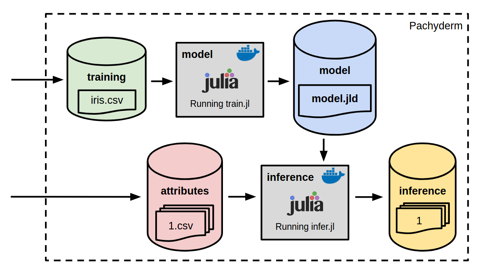

# Workshop - Integrating Julia in Real-World, Distributed Pipelines



This workshop focuses on building a production scale machine learning pipeline with [Julia](), [Docker](), [Kubernetes](), and [Pachyderm](http://pachyderm.io/).  In particular, this pipeline trains and utilizes a model that predicts the species of iris flowers, based on measurements of those flowers.

The below documentation walks you through experimentation with Docker and the deployment of the pipelines. It also emphasizes a few key features related to reproducibility, pipeline triggering, and provenance:

1. [Prepare a Julia program and Docker image for training](README.md#1-prepare-a-julia-program-and-docker-image-for-model-training)
2. [Prepare a Julia program and Docker image for inference](README.md#2-prepare-a-julia-program-and-docker-image-for-inference)
3. [Connect to your Kubernetes cluster](README.md#3-connect-to-your-kubernetes-cluster)
4. [Check that Pachyderm is running on Kubernetes](README.md#4-check-that-pachyderm-is-running-on-kubernetes)
5. [Create the input "data repositories"](README.md#5-create-the-input-data-repositories)
6. [Commit the training data set into Pachyderm](README.md#6-commit-the-training-data-set-into-pachyderm)
7. [Create the training pipeline](README.md#7-create-the-training-pipeline)
8. [Commit input attributes](README.md#8-commit-input-attributes)
9. [Create the inference pipeline](README.md#9-create-the-inference-pipeline)
10. [Examine the results](README.md#10-examine-the-results)

Bonus:

11. [Parallelize the inference](README.md#11-parallelize-the-inference)
12. [Update the model training](README.md#12-update-the-model-training)
13. [Update the training data set](README.md#13-update-the-training-data-set)
14. [Examine pipeline provenance](README.md#14-examine-pipeline-provenance)

Finally, we provide some [Resources](README.md#resources) for you for further exploration.

## Prerequisites

- Ability to `ssh` into a remote machine.
- An IP for a remote machine (this should have been given to you at the beginning of the workshop).
- Access to this repository on GitHub (we will clone it later on the remote machine). 

## 1. Prepare a Julia program and Docker image for model training

First, let's `ssh` into our development/workshop machine.  As will be discussed later, this machine is connected to a running kubernetes instance, a pachyderm cluster, and has everything you need to complete the workshop.  You should have been given an IP for your dev machine at the beginning of the workshop.  Use that IP where indicated (`<your ip>`) below to connect to the machine:

```
$ ssh pachrat@<your ip>
```

You will be prompted for a password that will be given out at the workshop.

Now, let's learn how to prepare a containerized Julia program to train our iris species prediction model. Clone this Github repo on the dev machine as follows:

```
$ git clone https://github.com/dwhitena/julia-workshop.git
```

You should now see a folder containing the contents of this repo:

```
$ ls
admin.conf  julia-workshop
```

Navigate to the `train-tree` folder in this workshop repo.  Here you will find a Julia program, [train.jl](train-tree/train.jl), that uses the `DecisionTree` package to train and export a model for predicting iris flower species:

```
$ cd julia-workshop/train-tree/
$ ls
Dockerfile  package_installs.jl  train.jl
```

You can also see that we have a Julia program `package_installs.jl` that installs the necessary packages for our model training, and we have a "Dockerfile."  This [Dockerfile](train-tree/Dockerfile) tells Docker how to build a Docker "image" for our model training.  As you can see, in our Docker image, we are installing a couple of dependencies, running `package_installs.jl` and adding our `train.jl` program.  

We have already pre-built this Docker image and uploaded it to Docker Hub [here](https://hub.docker.com/r/dwhitena/julia-train/) for use in this workshop.  However, if you wanted to experiment with this image locally and/or build another Julia Docker image, you just need to [install Docker](https://docs.docker.com/engine/installation/) and "build" this Docker image. To "build" the Docker image, you can run something similar to:

(Note this following won't work on the dev/workshop instance because of certain permissions, but you could do the following to build the Docker image locally, assuming you have Docker installed. Please wait to install and run this until after the workshop so we don't take down the Wifi. haha)

```
$ docker build -t dwhitena/julia-train:tree .
Sending build context to Docker daemon  4.096kB
Step 1/4 : FROM julia
 ---> f988666c0ef7
Step 2/4 : ADD package_installs.jl /tmp/package_installs.jl
 ---> 649aff2f1f78
Removing intermediate container fbdf08c34c45
Step 3/4 : RUN apt-get update &&     apt-get install -y build-essential hdf5-tools &&     julia /tmp/package_installs.jl &&     rm -rf /var/lib/apt/lists/*
 ---> Running in 74fd7254bb87
Get:1 http://security.debian.org jessie/updates InRelease [63.1 kB]
Ign http://deb.debian.org jessie InRelease
Get:2 http://deb.debian.org jessie-updates InRelease [145 kB]
Get:3 http://deb.debian.org jessie Release.gpg [2373 B]
Get:4 http://deb.debian.org jessie Release [148 kB]
Get:5 http://security.debian.org jessie/updates/main amd64 Packages [523 kB]
Get:6 http://deb.debian.org jessie-updates/main amd64 Packages [17.8 kB]
Get:7 http://deb.debian.org jessie/main amd64 Packages [9065 kB]
Fetched 9965 kB in 5s (1674 kB/s)
Reading package lists...
Reading package lists...
Building dependency tree...
Reading state information...
The following extra packages will be installed:
  binutils bzip2 cpp cpp-4.9 dpkg-dev fakeroot g++ g++-4.9 gcc gcc-4.9
  libalgorithm-c3-perl libalgorithm-diff-perl libalgorithm-diff-xs-perl

etc...
```    

Your Docker image will then be listed under `docker images`:

```
$ docker images
REPOSITORY                                 TAG                 IMAGE ID            CREATED             SIZE
<none>                                     <none>              649aff2f1f78        7 hours ago         371MB
<none>                                     <none>              c530a73337d8        7 hours ago         371MB
dwhitena/iris-infer                        julia               5716b96aff25        21 hours ago        557MB
dwhitena/julia-infer                       <none>              5716b96aff25        21 hours ago        557MB
dwhitena/iris-train                        julia-tree          28606eba05de        21 hours ago        557MB

etc...
```

The Docker image can then be run manually (and interactively) as follows.  We can see that julia runs in the Docker container and our `train.jl` program is included:

```
$ docker run -it dwhitena/julia-train:tree /bin/bash
root@2862b6f9ea24:/# julia
               _
   _       _ _(_)_     |  A fresh approach to technical computing
  (_)     | (_) (_)    |  Documentation: https://docs.julialang.org
   _ _   _| |_  __ _   |  Type "?help" for help.
  | | | | | | |/ _` |  |
  | | |_| | | | (_| |  |  Version 0.5.2 (2017-05-06 16:34 UTC)
 _/ |\__'_|_|_|\__'_|  |  Official http://julialang.org/ release
|__/                   |  x86_64-pc-linux-gnu

julia> 1+1
2

julia> exit()
root@2862b6f9ea24:/# cat /train.jl 
using DataFrames
using DecisionTree
using JLD

# Read the iris data set.
df = readtable(ARGS[1], header = false)

# Get the features and labels.
features = convert(Array, df[:, 1:4])
labels = convert(Array, df[:, 5])

# Train decision tree classifier.
model = DecisionTreeClassifier(pruning_purity_threshold=0.9, maxdepth=6)
DecisionTree.fit!(model, features, labels)

# Save the model.
save(ARGS[2], "model", model)

root@2862b6f9ea24:/#
```

As mentioned, we have already uploaded this image to Docker Hub for use in this workshop.  This was done by building the image as above and using `docker push` to push the image to the public Docker Hub registry.  When we use the image later in the workshop, we will be "pulling" that image on Docker Hub tagged as `dwhitena/julia-train:tree`.

## 2. Prepare a Julia program and Docker image for inference

Similar to the process in section (1), we have created a Julia program, [infer.jl](infer/infer.jl), and a corresponding Docker image to be used for inference in our ML pipeline. This Docker image is uploaded to Docker Hub as [dwhitena/julia-infer](https://hub.docker.com/r/dwhitena/julia-infer/).

`infer.jl` does a few things:

- takes a trained, persisted `model.jld` as input (the output of `train.jl`)
- takes a directory as input
- walks over files in that directory, where the files are sets of new iris attributes
- infers the species of each of the reviews
- outputs the inferred species to a specified output directory

## 3. Connect to your Kubernetes cluster

On your dev/workshop machine, you should be connected to a running Kubernetes cluster.  You can interact with this cluster via the Kubernetes CLI, `kubectl`.  As a sanity check, you can make sure that kubernetes is up and running as follows:

```
$ kubectl get all
NAME                        READY     STATUS    RESTARTS   AGE
po/etcd-4197107720-906b7    1/1       Running   0          31m
po/pachd-3548222380-cm1ts   1/1       Running   0          31m

NAME             CLUSTER-IP     EXTERNAL-IP   PORT(S)                       AGE
svc/etcd         10.97.253.64   <nodes>       2379:32379/TCP                31m
svc/kubernetes   10.96.0.1      <none>        443/TCP                       32m
svc/pachd        10.108.55.75   <nodes>       650:30650/TCP,651:30651/TCP   31m

NAME           DESIRED   CURRENT   UP-TO-DATE   AVAILABLE   AGE
deploy/etcd    1         1         1            1           31m
deploy/pachd   1         1         1            1           31m

NAME                  DESIRED   CURRENT   READY     AGE
rs/etcd-4197107720    1         1         1         31m
rs/pachd-3548222380   1         1         1         31m
```

## 4. Check that Pachyderm is running on Kubernetes 

Pachyderm should also be running on your Kubernetes cluster.  To verify that everything is running correctly on the machine, you should be able to run the following with the corresponding response:

```
$ pachctl version
No config detected.
Default config created at /home/pachrat/.pachyderm/config.json
COMPONENT           VERSION             
pachctl             1.4.7-RC1           
pachd               1.4.7-RC1
```

(note, this was the first time you ran `pachctl` on the machine, so a `pachctl` config was automatically created)

## 5. Create the input data repositories 

On the Pachyderm cluster running in your remote machine, we will need to create the two input data repositories (for our training data and input iris attributes).  To do this run:

```
$ pachctl create-repo training
$ pachctl create-repo reviews
```

As a sanity check, we can list out the current repos, and you should see the two repos you just created:

```
$ pachctl list-repo
NAME                CREATED             SIZE                
attributes          5 seconds ago       0 B                 
training            8 seconds ago       0 B
```

## 6. Commit the training data set into pachyderm

We have our training data repository, but we haven't put our training data set into this repository yet.  The training data set, `iris.csv`, is included here in the [data](data) directory. 

To get this data into Pachyderm, navigate to this directory and run:

```
$ cd /home/pachrat/julia-workshop/data
$ pachctl put-file training master -c -f iris.csv
```

Then, you should be able to see the following:

```
$ pachctl list-repo
NAME                CREATED             SIZE                
training            3 minutes ago       4.444 KiB           
attributes          3 minutes ago       0 B                 
$ pachctl list-file training master
NAME                TYPE                SIZE                
iris.csv            file                4.444 KiB
```

## 7. Create the training pipeline

Next, we can create the `model` pipeline stage to process the data in the training repository. To do this, we just need to provide Pachyderm with [a JSON pipeline specification](train.json) that tells Pachyderm how to process the data.  Once you have that pipeline spec, creating the training pipeline is as easy as:

```
$ cd ..
$ pachctl create-pipeline -f train.json
```

Immediately you will notice that Pachyderm has kicked off a job to perform the model training:

```
$ pachctl list-job
ID                                   OUTPUT COMMIT STARTED        DURATION RESTART PROGRESS STATE            
a0d78926-ce2a-491a-b926-90043bce7371 model/-       12 seconds ago -        0       0 / 1    running
```

This job should run for about 1-2 minutes (it actually runs faster after this, but we have to pull the Docker image on the first run).  After your model has successfully been trained, you should see:

```
$ pachctl list-job
ID                                   OUTPUT COMMIT                          STARTED       DURATION       RESTART PROGRESS STATE            
a0d78926-ce2a-491a-b926-90043bce7371 model/98e55f3bccc6444a888b1adbed4bba8b 2 minutes ago About a minute 0       1 / 1    success 
$ pachctl list-repo
NAME                CREATED             SIZE                
model               2 minutes ago       43.67 KiB           
training            8 minutes ago       4.444 KiB           
attributes          7 minutes ago       0 B                 
$ pachctl list-file model master
NAME                TYPE                SIZE                
model.jld           file                43.67 KiB
```

## 8. Commit input attributes

Great! We now have a trained model that will infer the species of iris flowers.  Let's commit some iris attributes into Pachyderm that we would like to run through the inference.  We have a couple examples under [test](test).  Feel free to use these, find your own, or even create your own.  To commit our samples (assuming you have cloned this repo on the remote machine), you can run:

```
$ cd /home/pachrat/julia-workshop/data/test/
$ pachctl put-file attributes master -c -r -f .
```

You should then see:

```
$ pachctl list-file attributes master
NAME                TYPE                SIZE                
1.csv               file                16 B                
2.csv               file                96 B 
```

## 9. Create the inference pipeline

We have another JSON blob, [infer.json](infer.json), that will tell Pachyderm how to perform the processing for the inference stage.  This is similar to our last JSON specification except, in this case, we have two input repositories (the `attributes` and the `model`) and we are using a different Docker image that contains `infer.jl`.  To create the inference stage, we simply run:

```
$ cd ../../
$ pachctl create-pipeline -f infer.json
```

This will immediately kick off an inference job, because we have committed unprocessed reviews into the `reviews` repo.  The results will then be versioned in a corresponding `inference` data repository:

```
$ pachctl list-job
ID                                   OUTPUT COMMIT                          STARTED        DURATION       RESTART PROGRESS STATE            
21552ae0-b0a9-4089-bfa5-d74a4a9befd7 inference/-                            33 seconds ago -              0       0 / 2    running 
a0d78926-ce2a-491a-b926-90043bce7371 model/98e55f3bccc6444a888b1adbed4bba8b 7 minutes ago  About a minute 0       1 / 1    success 
$ pachctl list-job
ID                                   OUTPUT COMMIT                              STARTED            DURATION       RESTART PROGRESS STATE            
21552ae0-b0a9-4089-bfa5-d74a4a9befd7 inference/c4f6b269ad0349469effee39cc9ee8fb About a minute ago About a minute 0       2 / 2    success 
a0d78926-ce2a-491a-b926-90043bce7371 model/98e55f3bccc6444a888b1adbed4bba8b     8 minutes ago      About a minute 0       1 / 1    success 
$ pachctl list-repo
NAME                CREATED              SIZE                
inference           About a minute ago   100 B               
attributes          13 minutes ago       112 B               
model               8 minutes ago        43.67 KiB           
training            13 minutes ago       4.444 KiB
```

## 10. Examine the results

We have created results from the inference, but how do we examine those results?  There are multiple ways, but an easy way is to just "get" the specific files out of Pachyderm's data versioning:

```
$ pachctl list-file inference master
NAME                TYPE                SIZE                
1.csv               file                15 B                
2.csv               file                85 B                
$ pachctl get-file inference master 1.csv
Iris-virginica
$ pachctl get-file inference master 2.csv
Iris-versicolor
Iris-virginica
Iris-virginica
Iris-virginica
Iris-setosa
Iris-setosa
```

Here we can see that each result file contains a predicted iris flower species corresponding to each set of input attributes.

## Bonus exercises

You may not get to all of these bonus exercises during the workshop time, but you can perform these and all of the above steps any time you like with a [simple local Pachyderm install](http://docs.pachyderm.io/en/latest/getting_started/local_installation.html).  You can spin up this local version of Pachyderm is just a few commands and experiment with this, [other Pachyderm examples](http://docs.pachyderm.io/en/latest/examples/readme.html), and/or your own pipelines.

### 11. Parallelize the inference

You may have noticed that our pipeline specs included a `parallelism_spec` field.  This tells Pachyderm how to parallelize a particular pipeline stage.  Let's say that in production we start receiving a huge number of attribute files, and we need to keep up with our inference.  In particular, let's say we want to spin up 10 inference workers to perform inference in parallel.

This actually doesn't require any change to our code.  We can simply change our `parallelism_spec` in `infer.json` to:

```
  "parallelism_spec": {
    "strategy": "CONSTANT",
    "constant": "10"
  },
```

Pachyderm will then spin up 10 inference workers, each running our same `infer.jl` script, to perform inference in parallel.  This can be confirmed by updating our pipeline and then examining the cluster:

```
$ vim infer.json 
$ pachctl update-pipeline -f infer.json 
$ kubectl get all
NAME                             READY     STATUS        RESTARTS   AGE
po/etcd-4197107720-906b7         1/1       Running       0          52m
po/pachd-3548222380-cm1ts        1/1       Running       0          52m
po/pipeline-inference-v1-vsq8x   2/2       Terminating   0          6m
po/pipeline-inference-v2-0w438   0/2       Init:0/1      0          5s
po/pipeline-inference-v2-1tdm7   0/2       Pending       0          5s
po/pipeline-inference-v2-2tqtl   0/2       Init:0/1      0          5s
po/pipeline-inference-v2-6x917   0/2       Init:0/1      0          5s
po/pipeline-inference-v2-cc5jz   0/2       Init:0/1      0          5s
po/pipeline-inference-v2-cphcd   0/2       Init:0/1      0          5s
po/pipeline-inference-v2-d5rc0   0/2       Init:0/1      0          5s
po/pipeline-inference-v2-lhpcv   0/2       Init:0/1      0          5s
po/pipeline-inference-v2-mpzwf   0/2       Pending       0          5s
po/pipeline-inference-v2-p753f   0/2       Init:0/1      0          5s
po/pipeline-model-v1-1gqv2       2/2       Running       0          13m

NAME                       DESIRED   CURRENT   READY     AGE
rc/pipeline-inference-v2   10        10        0         5s
rc/pipeline-model-v1       1         1         1         13m

NAME                        CLUSTER-IP       EXTERNAL-IP   PORT(S)                       AGE
svc/etcd                    10.97.253.64     <nodes>       2379:32379/TCP                52m
svc/kubernetes              10.96.0.1        <none>        443/TCP                       53m
svc/pachd                   10.108.55.75     <nodes>       650:30650/TCP,651:30651/TCP   52m
svc/pipeline-inference-v2   10.99.47.41      <none>        80/TCP                        5s
svc/pipeline-model-v1       10.109.198.229   <none>        80/TCP                        13m

NAME           DESIRED   CURRENT   UP-TO-DATE   AVAILABLE   AGE
deploy/etcd    1         1         1            1           52m
deploy/pachd   1         1         1            1           52m

NAME                  DESIRED   CURRENT   READY     AGE
rs/etcd-4197107720    1         1         1         52m
rs/pachd-3548222380   1         1         1         52m
$ kubectl get all
NAME                             READY     STATUS    RESTARTS   AGE
po/etcd-4197107720-906b7         1/1       Running   0          53m
po/pachd-3548222380-cm1ts        1/1       Running   0          53m
po/pipeline-inference-v2-0w438   2/2       Running   0          40s
po/pipeline-inference-v2-1tdm7   2/2       Running   0          40s
po/pipeline-inference-v2-2tqtl   2/2       Running   0          40s
po/pipeline-inference-v2-6x917   2/2       Running   0          40s
po/pipeline-inference-v2-cc5jz   2/2       Running   0          40s
po/pipeline-inference-v2-cphcd   2/2       Running   0          40s
po/pipeline-inference-v2-d5rc0   2/2       Running   0          40s
po/pipeline-inference-v2-lhpcv   2/2       Running   0          40s
po/pipeline-inference-v2-mpzwf   2/2       Running   0          40s
po/pipeline-inference-v2-p753f   2/2       Running   0          40s
po/pipeline-model-v1-1gqv2       2/2       Running   0          14m

NAME                       DESIRED   CURRENT   READY     AGE
rc/pipeline-inference-v2   10        10        10        40s
rc/pipeline-model-v1       1         1         1         14m

NAME                        CLUSTER-IP       EXTERNAL-IP   PORT(S)                       AGE
svc/etcd                    10.97.253.64     <nodes>       2379:32379/TCP                53m
svc/kubernetes              10.96.0.1        <none>        443/TCP                       54m
svc/pachd                   10.108.55.75     <nodes>       650:30650/TCP,651:30651/TCP   53m
svc/pipeline-inference-v2   10.99.47.41      <none>        80/TCP                        40s
svc/pipeline-model-v1       10.109.198.229   <none>        80/TCP                        14m

NAME           DESIRED   CURRENT   UP-TO-DATE   AVAILABLE   AGE
deploy/etcd    1         1         1            1           53m
deploy/pachd   1         1         1            1           53m

NAME                  DESIRED   CURRENT   READY     AGE
rs/etcd-4197107720    1         1         1         53m
rs/pachd-3548222380   1         1         1         53m
```

### 12. Update the model training

You might have noticed that this repo includes two versions of the training program `train.jl`.  There is [train-tree/train.jl](train-tree/train.jl), which we used before in our pipeline, and then there is [train-forest/train.jl](train-forest/train.jl), which does a simliar training with a Random Forest model. 

Let's now imagine that we want to update our model to this random forest version. To do this, modify the image tag in `train.json`:
 
```
"image": "dwhitena/julia-train:forest",
```

Once you modify the spec, you can update the pipeline by running:

```
$ pachctl update-pipeline -f train.json
```

Pachyderm will then automatically kick off a new job to retrain our model with the random forest algo:

```
$ pachctl list-job
ID                                   OUTPUT COMMIT                              STARTED        DURATION       RESTART PROGRESS STATE            
7d913835-2c0a-42a3-bfa2-c8a5941ceaa5 model/-                                    3 seconds ago  -              0       0 / 1    running 
21552ae0-b0a9-4089-bfa5-d74a4a9befd7 inference/c4f6b269ad0349469effee39cc9ee8fb 11 minutes ago About a minute 0       2 / 2    success 
a0d78926-ce2a-491a-b926-90043bce7371 model/98e55f3bccc6444a888b1adbed4bba8b     19 minutes ago About a minute 0       1 / 1    success
```

Not only that, once the model is retrained, Pachyderm see the new model and updates our inferences with the latest version of the model:

```
$ pachctl list-job
ID                                   OUTPUT COMMIT                              STARTED            DURATION       RESTART PROGRESS STATE            
0477e755-79b4-4b14-ac04-5416d9a80cf3 inference/5dec44a330d24a1cb3822610c886489b 53 seconds ago     44 seconds     0       2 / 2    success 
7d913835-2c0a-42a3-bfa2-c8a5941ceaa5 model/444b5950bcb642cfba5b087286640898     About a minute ago 56 seconds     0       1 / 1    success 
21552ae0-b0a9-4089-bfa5-d74a4a9befd7 inference/c4f6b269ad0349469effee39cc9ee8fb 13 minutes ago     About a minute 0       2 / 2    success 
a0d78926-ce2a-491a-b926-90043bce7371 model/98e55f3bccc6444a888b1adbed4bba8b     20 minutes ago     About a minute 0       1 / 1    success
```

### 13. Update the training data set

Let's say that one or more observations in our training data set were corrupt or unwanted.  Thus, we want to update our training data set.  To simulate this, go ahead and open up `iris.csv` (e.g., with `vim`) and remove a couple of the rows (non-header rows).  Then, let's replace our training set:

```
$ pachctl start-commit training master
9cc070dadc344150ac4ceef2f0758509
$ pachctl delete-file training 9cc070dadc344150ac4ceef2f0758509 iris.csv 
$ pachctl put-file training 9cc070dadc344150ac4ceef2f0758509 -f iris.csv 
$ pachctl finish-commit training 9cc070dadc344150ac4ceef2f0758509
```

Immediately, Pachyderm "knows" that the data has been updated, and it starts a new jobs to update the model and inferences:

### 14. Examine pipeline provenance

Let's say that we have updated our model or training set in one of the above scenarios (step 11 or 12).  Now we have multiple inferences that were made with different models and/or training data sets.  How can we know which results came from which specific models and/or training data sets?  This is called "provenance," and Pachyderm gives it to you out of the box.  

Suppose we have run the following jobs:

```
$ pachctl list-job
ID                                   OUTPUT COMMIT                              STARTED        DURATION       RESTART PROGRESS STATE            
0477e755-79b4-4b14-ac04-5416d9a80cf3 inference/5dec44a330d24a1cb3822610c886489b 6 minutes ago  44 seconds     0       2 / 2    success 
7d913835-2c0a-42a3-bfa2-c8a5941ceaa5 model/444b5950bcb642cfba5b087286640898     7 minutes ago  56 seconds     0       1 / 1    success 
2560f096-0515-4d68-be66-35e3b4f3e730 inference/db9e675de0274ce9a73d3fc9dd50fd51 13 minutes ago About a minute 1       2 / 2    success 
21552ae0-b0a9-4089-bfa5-d74a4a9befd7 inference/c4f6b269ad0349469effee39cc9ee8fb 19 minutes ago About a minute 0       2 / 2    success 
a0d78926-ce2a-491a-b926-90043bce7371 model/98e55f3bccc6444a888b1adbed4bba8b     26 minutes ago About a minute 0       1 / 1    success
```

If we want to know which model and training data set was used for the latest inference, commit id `5dec44a330d24a1cb3822610c886489b`, we just need to inspect the particular commit:

```
$ pachctl inspect-commit inference 5dec44a330d24a1cb3822610c886489b
$ pachctl inspect-commit inference 5dec44a330d24a1cb3822610c886489b
Commit: inference/5dec44a330d24a1cb3822610c886489b
Parent: db9e675de0274ce9a73d3fc9dd50fd51 
Started: 6 minutes ago
Finished: 6 minutes ago 
Size: 100 B
Provenance:  training/9881a078c14c47e9b71fcc626a86499f  attributes/f62907bda09d48cfa817476fd3e4f07f  model/444b5950bcb642cfba5b087286640898
```

The `Provenance` tells us exactly which model and training set was used (along with which commit to attributes triggered the inference).  For example, if we wanted to see the exact model used, we would just need to reference commit `444b5950bcb642cfba5b087286640898` to the `model` repo:

```
$ pachctl list-file model 444b5950bcb642cfba5b087286640898
NAME                TYPE                SIZE                
model.jld           file                70.34 KiB
```

We could get this model to examine it, rerun it, revert to a different model, etc.

## Resources

Docker

- [Install Docker](https://docs.docker.com/engine/installation/) locally.
- Start with the official [Julia base image](https://hub.docker.com/_/julia/).
- Check out the [Docker docs](https://docs.docker.com/).

Kubernetes:

- Start by playing with [minikube](https://kubernetes.io/docs/tutorials/stateless-application/hello-minikube/).
- Check out the [Kubernetes docs](https://kubernetes.io/docs/home/).

Pachyderm:

- Join the [Pachyderm Slack team](http://slack.pachyderm.io/) to ask questions, get help, and talk about production deploys.
- Follow [Pachyderm on Twitter](https://twitter.com/pachydermIO), 
- Find [Pachyderm on GitHub](https://github.com/pachyderm/pachyderm), and
- [Spin up Pachyderm](http://docs.pachyderm.io/en/latest/getting_started/getting_started.html) in just a few commands to try this and [other examples](http://docs.pachyderm.io/en/latest/examples/readme.html) locally.

